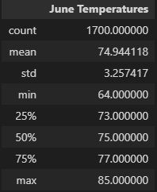
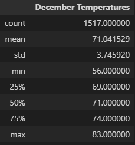

# Weather-SQLite-Flask

## Overview of the statistical analysis:

The Purpose of this analysis was to find recorded temperature and precipitation data for the island of Oahu in order to gain more information on the viability of a Surf and Ice Cream shop business.

## Results:

### June

Figure 1 shows that June temperatures are extremely consistent. The minimum temperature for June in any year is 64 degrees with a maximum of 85 degrees. These are extremely pleasant temperatures to live and surf in. In most places in the contiguous United States, Summer temperatures can meet or exceed 90 degrees, which makes people stay indoors when they could be out surfing and buying ice cream!

### December

Figure 2 shows December has only slightly lower temperatures than June, which means the temperature year round in Oahu has very little variability. It seems selling ice cream and renting surfboards as a business is feasible even in the wintertime.
### Key Differences between June and December

* Mean temperature for December is down from June by about 3 degrees
* The standard deviation is higher for December, meaning there is greater variability of temperature.
* For December, every quartile for temperature is down 3-4 degrees from June

In order to gether more data I would look to run queries to show precipitation amounts and duration in order to get more data about what seasons have the most storms. I would first look at March-May.

I know it often rains in short stops and starts in Hawaii, and isn't disruptive to daily life, except for major storms.

I would also like to run additional queries for recent data on other summer and winter months, particularly February and September.